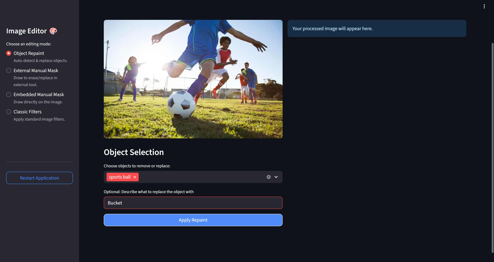
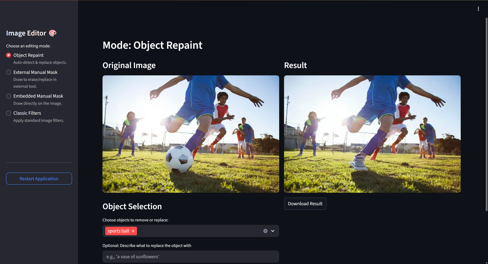
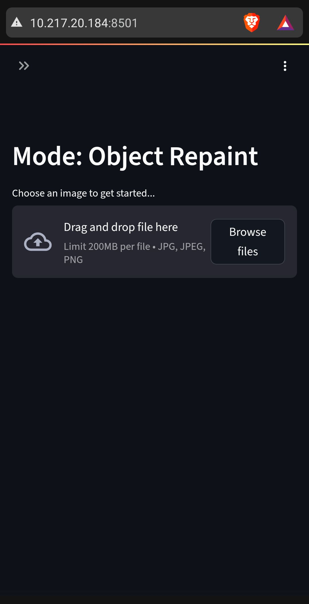
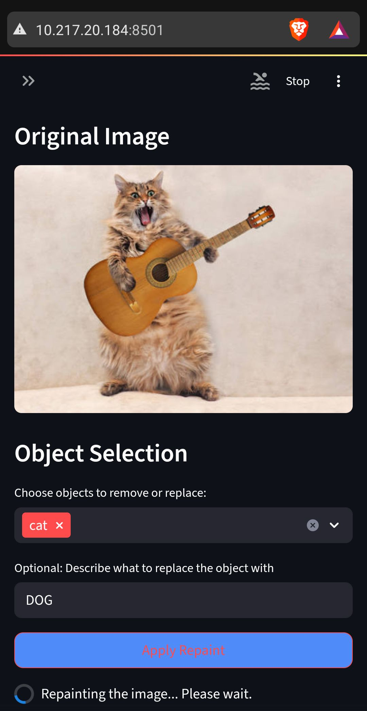
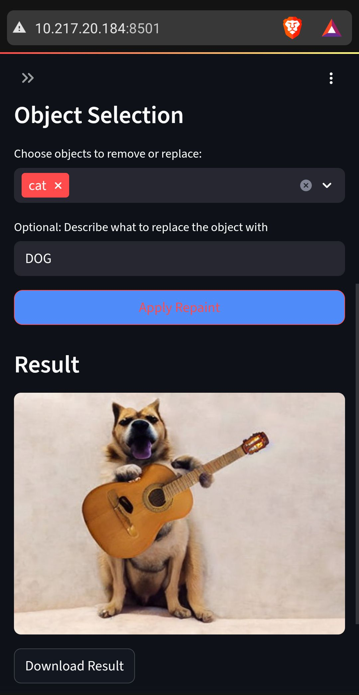
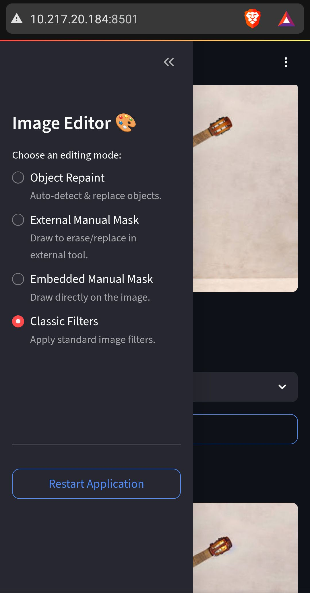
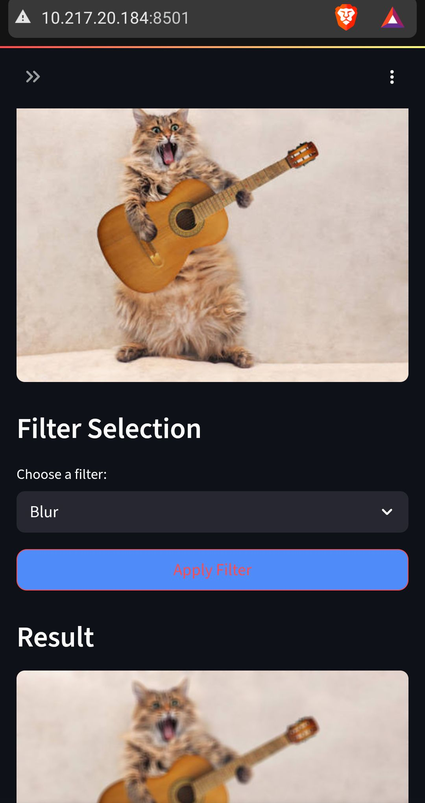

# Inpainting

This project provides a web application for inpainting images, allowing users to upload images, auto detect the objects and prompts user to select areas to inpaint, and view the results.


<div align="center">
<br>
<br>
<br>
<h2><strong>Inpainting</strong>: Image editor using Object detection and Diffusion based generation models</h2>
<p>Authors: 
<span style="
    font-size:16px;
    font-family:'Georgia', 'Garamond', 'Times New Roman', serif;
    font-weight:700;
    color:#94dfff;">
      <strong><a href="https://mahanthyalla.in" style="color:#94dfff;">
      Mahanth Yalla
    </a></strong>, <strong>Kaif Alam</strong>
  </span>
  </p>
<p align="center">
|  
<!-- <a href="./WhitePaper_ZeroShotUnlearning.pdf"><b>📄 White Paper</b></a> |  -->
<a href="https://mahanthyalla.in/Inpainting"><b>🌐 Web Page</b></a> | 
<a href="https://github.com/Mahanth-Maha/Inpainting#demo"><b>🎨 Demo</b></a> | 
<!-- <a href="https://mahanthyalla.in/blogs/p/zero-shot-unlearning/"><b> ✍️ Blog</b></a> |  -->
<a href="https://github.com/Mahanth-Maha/Inpainting#usage"><b>📃 Documentation</b></a> |
</p>
<br>
</div>


<!--  -->

<br>
<br>
    
---

## Status / Progress 

- Currently supports inpainting using pre-trained diffusion models.
- Supports classic image filters like blurring, grayscale, sepia, etc.
- Responsive web design for both PC and mobile devices.
- Backend API using FastAPI.
- Frontend using Streamlit.
- Docker support for easy deployment.
- Environment variable management using `.env` files.

### Features

#### Step-by-Step Flow Overview

  1. User uploads an image via the web interface.
1. The backend auto-detects objects in the image using pre-trained object detection models.
2. The user selects the object(s) they want to inpaint from a list of detected objects.
3. The user can optionally provide text prompts to guide the inpainting process.
4. The backend processes the request and generates the inpainted image using diffusion models.
5. The user can view and download the inpainted image.
6. Additionally, users can apply classic image filters to the uploaded images.
7. The web interface is responsive and works on both PC and mobile devices.

#### All Features

- **remove objects using auto-detected masks**: Users can upload an image, and the system will automatically detect objects and create masks for inpainting.
- **Manual Masking (external)**: Users can manually draw masks on the image using an external tool and upload the masked image for inpainting- integrated python tinker app.
- **Manual Masking (embedded)**: Users can manually draw masks on the image to specify areas for inpainting using canvas.
- **Classic Filters**: Apply classic image filters like blurring, grayscale, sepia, etc.
- **Text Prompting**: Users can provide text prompts to guide the inpainting process.
- **Downloadable Results**: Users can download the inpainted images directly from the web interface.
- **Responsive Design**: The web application is designed to be responsive and works well on both desktop and mobile devices.

#### Future Work

- **Additional Models**: Integrate more diffusion models for inpainting.
- **Fine-tuning**: fine-tune the inpainting models on specific datasets for improved performance. (for ex: removing specific objects like logos, watermarks, etc.)
- **Performance Optimization**: Optimize the backend for faster inpainting processing times.
- **Cloud Deployment**: Deploy the application on cloud platforms for wider accessibility.

## Demo
<!-- 
 -->

### Website - PC 

<figure style="width:90%;">
   
   <figcaption>Streamlit web page interface with uploaded image of kids playing football, selected object to remove as SportsBall <em>(Optionally we can add to replace with any object, here 'Bucket' text is just to demonstrate we can also add such request, but results below is generated without any text, hence removes and added shoe and NO bucket)</em></figcaption>
</figure>
<figure style="width:90%;">
   
   <figcaption>Results of above sportsball removal </figcaption>
</figure>

### Website - Mobile

<div style="display: flex; flex-wrap: wrap; justify-content: center; gap: 20px; text-align: center;">
  <figure style="flex: 1 1 300px; max-width: 45%;">
    
    <figcaption style="margin-top: 8px; font-style: italic; color: gray;">Mobile Interface</figcaption>
  </figure>
  <figure style="flex: 1 1 300px; max-width: 45%;">
    
    <figcaption style="margin-top: 8px; font-style: italic; color: gray;">Uploaded Image and Selected detected Object (Cat)</figcaption>
  </figure>
</div>

<div style="display: flex; flex-wrap: wrap; justify-content: center; gap: 20px; text-align: center;">
  <figure style="flex: 1 1 300px; max-width: 45%;">
    
    <figcaption style="margin-top: 8px; font-style: italic; color: gray;">Results</figcaption>
  </figure>
  <!-- <figure style="flex: 1 1 300px; max-width: 45%;">
    
    <figcaption style="margin-top: 8px; font-style: italic; color: gray;">Second Image Caption</figcaption>
  </figure> -->
</div>

### Classic Filters

<div style="display: flex; flex-wrap: wrap; justify-content: center; gap: 20px; text-align: center;">
  <figure style="flex: 1 1 300px; max-width: 45%;">
    
    <figcaption style="margin-top: 8px; font-style: italic; color: gray;">Menu to Select - Interface</figcaption>
  </figure>
  <figure style="flex: 1 1 300px; max-width: 45%;">
    
    <figcaption style="margin-top: 8px; font-style: italic; color: gray;">Blurring image example</figcaption>
  </figure>
</div>


## Usage

### Setup 

1. Clone the repository:
```bash
git clone https://github.com/Mahanth-Maha/Inpainting.git
cd Inpainting
```

2. Create a virtual environment:
```bash 
conda create -n inpaint python=3.9 -y 
conda activate inpaint

```

2. install ipykernel to work in jupyter notebook:
```bash
conda install -c anaconda ipykernel -y
python -m ipykernel install --user --name inpaint --display-name "inpaint"

``` 

3. Install pytorch package by visit [pytorch.org](https://pytorch.org/get-started/locally/) 

   or use the following command for CUDA 12.8:
```bash
pip3 install torch torchvision torchaudio --index-url https://download.pytorch.org/whl/cu128

```

4. Install the required packages:
```bash
pip install -r requirements.txt

```

5. create `.env` file by copying `env_template`:
```bash
cp env_template .env

```
 - fill the `.env` file with the required environment variables. 
    - You can use the following values for testing:
```python
# .env default settings
ANNOTE_MAPPING_FILE_PATH="models/annotations/coco_category_mapping.json"
DEBUG_LEVEL="INFO"
```


### Run Server (Backend)
open a terminal and run the following command (keep this terminal open):
```bash
conda activate inpaint
cd src/backend
uvicorn main:app --reload

```

### Run Webapp (Frontend)
Open another terminal and run the following command (keep this terminal open):
```bash
conda activate inpaint
cd src/frontend
streamlit run app.py

```
It will launch the web app in your default browser, usually at [http://localhost:8501](http://localhost:8501).

## Contributors :
* Mahanth Yalla -  mahanthyalla [at] iisc.ac.in
* Md Kaif Alam  - kaifalam [at] iisc.ac.in